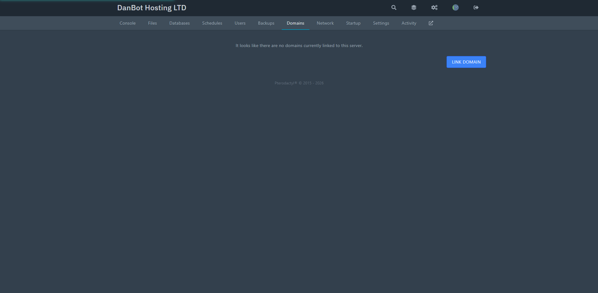
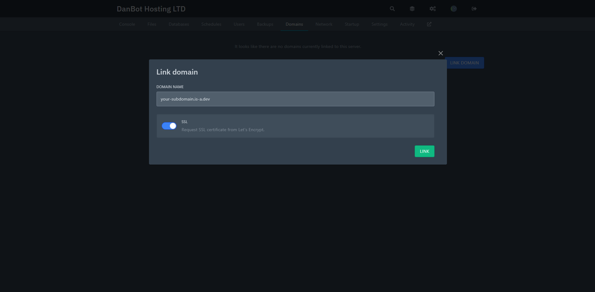

!!!danger
This hosting provider has changed a lot in recent times, so this guide may not be up to date with the current system the hosting provider has.
!!!

# Setting up DanBot Hosting with an is-a.dev subdomain

This guide will walk you through the process of setting up a DanBot Hosting website and pointing your is-a.dev subdomain to it.

## Proxy IP

The current proxy IP is: 82.38.134.96 for Proxy #1 at [DanBot Hosting](https://discord.gg/dbh)

### Creating the domain file

Create a JSON file inside `domains` directory (`domains/subdomain.json`) with the following content and submit a pull request:

```json
{
    "owner": {
        "username": "github-username",
        "email": "me@example.com"
    },
    "records": {
        "A": ["proxy-ip-here"]
    }
}
```

**Note:** In the owner section, you can add any social media handle, such as Discord. If you add another social media account, you may omit the email field. However, the GitHub username is mandatory. Don't forget to provide a preview of your website in your pull request.

## Configuring

After your pull request is merged, locate the server you wish to proxy. Head on over to the domains tab after selecting your server. 



Enter your subdomain you wish to use, like: your-subdomain.is-a.dev, select the SSL option and hit link button. 


